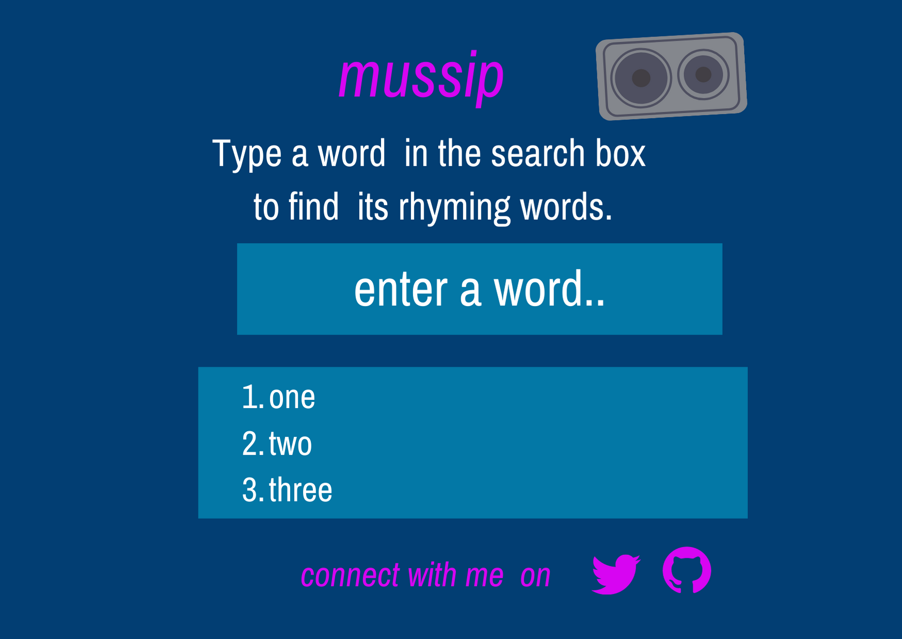

<!-- name -->
# mussip 🎼
<!-- description usage -->

### mussip allows you to search for words that rhyme.

### The app is for  musicians and poets to find words that rhyme and  incoperate them in  their music and poems.

<!-- look of the app-->

<!-- the link to be changed inorder to be viewable in github -->

<!-- dev side -->

# mussip design  look 

# connect with me  on [twitter](https://twitter.com/kyarleschalo) and on [github](https://github.com/charleskyalo) and on whatsapp 

## This is practice  project on using [datamouseapi](https://datamouse.com) with javaScript 
1. Dom.
2. intergrating external api with frontEndApllication.
3. layout in css

:smile: